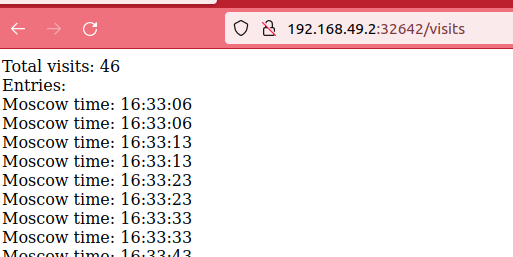
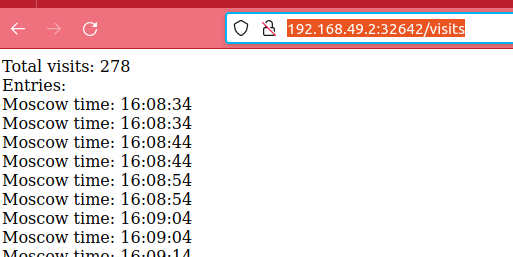

# K8s StatefulSet

## Command outputs

```bash
$ kubectl get po,sts,svc,pvc
NAME                                     READY   STATUS    RESTARTS       AGE
pod/time-web-app-python-0                1/1     Running   0              100s
pod/time-web-app-python-1                1/1     Running   0              90s
pod/time-web-app-rust-57978d7bfb-crbhc   1/1     Running   1 (178m ago)   6d

NAME                                   READY   AGE
statefulset.apps/time-web-app-python   2/2     100s

NAME                          TYPE           CLUSTER-IP     EXTERNAL-IP   PORT(S)        AGE
service/kubernetes            ClusterIP      10.96.0.1      <none>        443/TCP        25d
service/time-web-app-python   LoadBalancer   10.110.11.69   <pending>     80:32642/TCP   100s
service/time-web-app-rust     LoadBalancer   10.99.32.213   <pending>     80:31845/TCP   6d

NAME                                                            STATUS   VOLUME                                     CAPACITY   ACCESS MODES   STORAGECLASS   AGE
persistentvolumeclaim/data-mysql-1667654941-0                   Bound    pvc-d7e9be0d-acb7-4db4-8fb6-a9f26638ca04   8Gi        RWO            standard       19d
persistentvolumeclaim/persistent-volume-time-web-app-python-0   Bound    pvc-e210a37c-651e-4487-a283-ce934fdca947   64Mi       RWO            standard       26m
persistentvolumeclaim/persistent-volume-time-web-app-python-1   Bound    pvc-9e3d7dc1-e5cb-4014-87c5-4b43b1074459   64Mi       RWO            standard       90s
```

Opening `/visits` endpoint through browser gives either >200 or <50 entries, which means that either pod with claim 0 (older) or 1 is accessed. There are so many timestamps because healthcheck pings `/`, which are recorded




Inspecting contents (only tail bc they're large now)

```bash
$ kubectl exec pod/time-web-app-python-0 -- tail -c 115 persistent/visits.json
 "Moscow time: 16:46:01", "Moscow time: 16:46:01", "Moscow time: 16:46:11", "Moscow time: 16:46:11"], "total": 392}

$ kubectl exec pod/time-web-app-python-1 -- tail -c 115 persistent/visits.json
 "Moscow time: 16:45:53", "Moscow time: 16:45:53", "Moscow time: 16:46:03", "Moscow time: 16:46:03"], "total": 158}
```

The difference occurs because in StatefulSet separates sets of the replicas. It means each manages its own copy of volume we have mounted. The total number of timestamps is different because one of the volumes was created a couple minutes before the other and healthcheck had time to spam `/` so much.

## Ordering

In our case the replicas are completely independent between each other, so we do not need any ordering. For example, some systems may have leader (as replica with name '...-0' for example) and rely on it always having the same name (ending with 0). In this case, ordering matters, since followers wouldn't be able to work without the leader and need to wait for it to launch/start.

Added parameter `podManagementPolicy: "Parallel"`.

Now they indeed start and end in parallel. We can see that both switch to state `ContainerCreating` before being in `Running`:

```bash
$ kubectl get pod -w
NAME                                 READY   STATUS              RESTARTS        AGE
time-web-app-rust-57978d7bfb-crbhc   1/1     Running             1 (3h23m ago)   6d
time-web-app-python-0                0/1     Pending             0               0s
time-web-app-python-0                0/1     Pending             0               0s
time-web-app-python-1                0/1     Pending             0               0s
time-web-app-python-1                0/1     Pending             0               0s
time-web-app-python-0                0/1     ContainerCreating   0               0s
time-web-app-python-1                0/1     ContainerCreating   0               0s
time-web-app-python-0                0/1     Running             0               2s
time-web-app-python-1                0/1     Running             0               2s
time-web-app-python-1                1/1     Running             0               11s
time-web-app-python-0                1/1     Running             0               11s
time-web-app-python-1                1/1     Terminating         0               79s
time-web-app-python-0                1/1     Terminating         0               79s
time-web-app-python-0                0/1     Terminating         0               82s
time-web-app-python-0                0/1     Terminating         0               82s
time-web-app-python-0                0/1     Terminating         0               82s
time-web-app-python-1                0/1     Terminating         0               82s
time-web-app-python-1                0/1     Terminating         0               82s
time-web-app-python-1                0/1     Terminating         0               82s
```

## Bonus

### Bonus app

Added same things to bonus app. Works just the same

```bash
$ kubectl get po,sts,svc,pvc
NAME                      READY   STATUS    RESTARTS   AGE
pod/time-web-app-rust-0   1/1     Running   0          4m24s
pod/time-web-app-rust-1   1/1     Running   0          4m24s

NAME                                 READY   AGE
statefulset.apps/time-web-app-rust   2/2     4m24s

NAME                        TYPE           CLUSTER-IP       EXTERNAL-IP   PORT(S)        AGE
service/kubernetes          ClusterIP      10.96.0.1        <none>        443/TCP        25d
service/time-web-app-rust   LoadBalancer   10.101.198.124   <pending>     80:32222/TCP   4m24s

NAME                                                            STATUS   VOLUME                                     CAPACITY   ACCESS MODES   STORAGECLASS   AGE
persistentvolumeclaim/data-mysql-1667654941-0                   Bound    pvc-d7e9be0d-acb7-4db4-8fb6-a9f26638ca04   8Gi        RWO            standard       19d
persistentvolumeclaim/persistent-volume-time-web-app-python-0   Bound    pvc-e210a37c-651e-4487-a283-ce934fdca947   64Mi       RWO            standard       61m
persistentvolumeclaim/persistent-volume-time-web-app-python-1   Bound    pvc-9e3d7dc1-e5cb-4014-87c5-4b43b1074459   64Mi       RWO            standard       36m
persistentvolumeclaim/persistent-volume-time-web-app-rust-0     Bound    pvc-403c310f-a013-4ca1-91ed-377cb884c306   64Mi       RWO            standard       5m26s
persistentvolumeclaim/persistent-volume-time-web-app-rust-1     Bound    pvc-a9ade24e-6c29-42a5-a919-1be788842b19   64Mi       RWO            standard       4m40s
```

### Update strategies

Sources: [AWS guide](https://docs.aws.amazon.com/managedservices/latest/appguide/update-strategies.html)
